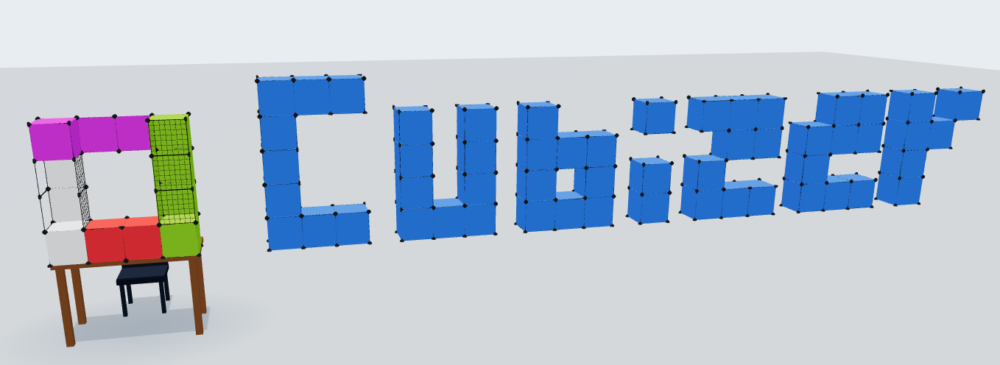

# Cubizer

<p align="center">
  <a href="https://xaviergmail.github.io/cubizer/">
    
  </a>
</p>

<p align="center"><em>Build artist-alley displays from 12&Prime; panels and corner connectors — right in your browser.</em></p>

**[Open Cubizer →](https://xaviergmail.github.io/cubizer/)**

Cubizer is a 3D web app for planning artist-alley booths: assemble 12&Prime; square panels joined by corner connectors into tables, walls, backdrops, and cubes. Drag panels from the palette onto the table, chain them along edges, and paint whole rows in one drag.

## Features

- **3D display building** — place 12&Prime; panels on the table or snapped to existing panels' corners; connectors render automatically at every joined corner.
- **Continuous placement** — click a square to place, then press and drag to paint a whole row; the stroke lands as a single undo step.
- **Three panel types by default** — solid, grid, and outline — plus custom color panels you can add in any hue, with global metal and connector color controls.
- **Drag & drop** — drag a panel type from the sidebar onto the table to place it, or onto a placed panel to re-type it.
- **Quick build mode** — stationary click places, right-click deletes, drag replaces.
- **Undo / redo** — 100-step history with sidebar buttons and <kbd>Ctrl+Z</kbd> / <kbd>Ctrl+Shift+Z</kbd> / <kbd>Ctrl+Y</kbd>.
- **Camera controls** — orbit (left-drag from empty space or right-drag), pan (middle-drag), zoom (wheel), and a one-click camera reset.
- **Table sizes** — 3 ft, 4 ft, 6 ft, and 8 ft tables; the build area and camera framing follow.
- **Persistence & sharing** — named browser saves, autosaved work state, and a shareable URL that encodes the whole assembly (including panel colors and table size).
- **Works on phones** — touch gestures for orbit/pan/zoom and a forced-landscape layout on small portrait screens.

## Developer instructions

```bash
npm install
npm run dev      # dev server with hot reload
npm run build    # typecheck + production build to dist/
npm run preview  # serve the production build
npm test         # Playwright specs (browsers: npx playwright install)
```

## Tech

Vite + TypeScript + Three.js (no framework layer). Connectors render via `InstancedMesh` batches; the vendor chunk is split for cache-friendly deploys. Playwright specs live in `tests/builder.spec.ts`.

## Deployment

Pushes to `main` build and deploy automatically to GitHub Pages via [`.github/workflows/deploy-pages.yml`](.github/workflows/deploy-pages.yml). The base path is derived from the repository name, so the site lives at https://xaviergmail.github.io/cubizer/.
